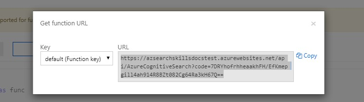

### **This tutorial assumes you already have an instance of Azure Search running. See the documentation here to get started with Azure Search https://docs.microsoft.com/en-us/azure/search/**

If you're unfamiliar with Azure Search Cognitive Skills you can read more about them here:
https://docs.microsoft.com/en-us/azure/search/cognitive-search-concept-intro

## Prerequisites

Before running this sample, you must have the following:

* Install the [Azure CLI](https://docs.microsoft.com/en-us/cli/azure/install-azure-cli?view=azure-cli-latest). This article requires the Azure CLI version 2.0 or later. Run `az --version` to find the version you have.  
You can also use the [Azure Cloud Shell](https://shell.azure.com/bash).

* If you want to run the function locally install [Azure Function Core Tools version 2.x](https://docs.microsoft.com/en-us/azure/azure-functions/functions-run-local#v2)


# Running the Function App locally

If you just want to skip this and just deploy the prebuilt container to an Azure Function skip to [Deploy Docker Container to Azure Functions using Azure CLI](#deploy-docker-container-to-azure-functions-using-azure-cli)

## Clone this repo

```
git clone https://github.com/Microsoft/SkillsExtractorCognitiveSearch
```

## Start the Function

```
func host start
```

When the Functions host starts, it write something like the following output, which has been truncated for readability

```output
                  %%%%%%
                 %%%%%%
            @   %%%%%%    @
          @@   %%%%%%      @@
       @@@    %%%%%%%%%%%    @@@
     @@      %%%%%%%%%%        @@
       @@         %%%%       @@
         @@      %%%       @@
           @@    %%      @@
                %%
                %

...
Content root path: C:\functions\MyFunctionProj
Now listening on: http://0.0.0.0:7071
Application started. Press Ctrl+C to shut down.

Http Functions:

        extract_skills: [POST] http://localhost:7071/api/extract_skills

        get_skill: [GET] http://localhost:7071/api/skills/{skill_id}

[8/27/2018 10:38:27 PM] Host started (29486ms)
[8/27/2018 10:38:27 PM] Job host started
```

## Test the Function locally

Lets make sure we can process Azure Search Records as expected.
Run the following POST request to test your function locally.

```http
POST http://localhost:7071/api/extract_skills?skill_property=name
Content-Type: application/json
```
```json
{
    "values": [
        {
            "recordId": "a3",
            "data": {
                "text": "Azure Machine Learning team is a fast-paced product group within the Microsoft Artificial Intelligence & Research organization. We are building the Machine Learning development platform that will make it easy for all data scientists and AI Developers to create and deploy robust, scalable and highly available machine learning solutions on the cloud, using the best of the open source ecosystem and innovation from inside the company and the latest breakthroughs in research We are looking for a Principal Program Manager who is passionate about delivering a highly available and reliable cloud platform that will transform the data science and machine learning experience. Come to build out and lead the Artificial Intelligence/Machine/Deep Learning investments, define innovative experiences for data science, and extend the state of the art in deep learning performance and efficiency in the industry. We are looking for a creative and technically minded product visionary with expertise in building and shipping large scale user experiences. A strong performer that can lead our UX efforts and drive cross-team initiatives to address major customer needs. Responsibilities In this role you will be responsible for leading the development of our Azure Machine Learning Web UX and drive our journey to modernize the appearance combining the different AML properties into one portal UX. You’ll help define the roadmap and the vision for our next generation of data science web experiences. You will be working closely with design and research counterparts to invent great data science experiences and lead the development team to deliver these modern experiences to our highly engaged customers. You will work with teams across the org to make this experience simple, reliable, fast and coherent with the other Microsoft AI products. Qualifications Have experience in building and leading teams and driving large cross team efforts.Have a track record in building and shipping products with an emphasis on UX.Are equally comfortable articulating the big picture and refining the small details.Are customer and data obsessed, always learning and refining your features to deliver maximum business impact. Have a BS Degree in Engineering, Computer Science, or similar degree. 7+ years of Product or Program Management experience. #AIPLATFORM##AIPLATREF#",
                "language": "en"
            }
        }
   ]
}
```

You should see a response that looks like this:

```json
{
    "values": [
        {
            "recordId": "a3",
            "data": {
                "skills": [
                    "Artificial intelligence",
                    "Azure Machine Learning",
                    "Business",
                    "Computer science",
                    "Data science",
                    "Deep learning",
                    "Design",
                    "Engineering",
                    "Machine learning"
                ]
            },
            "errors": null,
            "warnings": null
        }
    ]
}
```

It looks like we missed one potential skill: **UX**
Let's add **UX** as a skill we want to extract.

## Add a new Skill

The main `data/skill_patterns.jsonl` file is built programatically from `data/skills.json`
so we won't edit it directly. Instead we're going to add any new patterns to `data/extra_skill_patterns.jsonl`

Open the `data/extra_skill_patterns.jsonl` file and the following lines.

```json
{"label":"SKILL|ux","pattern":[{"LOWER":"ux"}]}
{"label":"SKILL|ux","pattern":[{"LOWER":"user"}, {"LOWER":"experience"}]}
```

This pattern syntax is specific to SpaCy's rule based matching. If you want learn more about the pattern syntax the SpaCy Docs have a great User Guide here:

https://spacy.io/usage/rule-based-matching#entityruler

> JSONL (files like *.jsonl) is an extension of JSON where each new line is a separate JSON object

## Restart the Function and test your new patterns

End the running host process and start the Functions host again with

```
func host start
```

Run the same POST request as before to `http://localhost:7071/api/extract_skills?skill_property=name`

Your response should now have UX included in the list of skills like below:

```json
{
    "values": [
        {
            "recordId": "a3",
            "data": {
                "skills": [
                    "Artificial intelligence",
                    "Azure Machine Learning",
                    "Business",
                    "Computer science",
                    "Data science",
                    "Deep learning",
                    "Design",
                    "Engineering",
                    "Machine learning",
                    "UX"
                ]
            },
            "errors": null,
            "warnings": null
        }
    ]
}
```

## Build a Docker Image from the Dockerfile

In the root folder run the `docker build` command providing your Docker Hub user id, image name and tag name

For instance
```
docker build . -t <docker_id>/skills-extractor-cognitive-search:v1.0.0
```

## Push the built image to Docker Hub

You need to be logged in to push this image to Docker Hub

Docker Login
```
docker login -u <docker_id> -p <dockerhub_password>
```

Push your image to Docker Hub

For instance
```
docker push <docker_id>/skills-extractor-cognitive-search:v1.0.0
```

Next we'll deploy this container to Azure Functions using the Azure CLI


# Deploy Docker Container to Azure Functions using Azure CLI

The first step is deploy your own instance of the Skills Extractor Azure Function.
You can build and host the container yourself from this repo or use the prebuilt container on Docker Hub: `mcr.microsoft.com/wwllab/skills/skills-extractor-cognitive-search`

> For a more complete walktrhough of deploying Azure Functions, Follow instructions here: 
https://docs.microsoft.com/en-us/azure/azure-functions/functions-create-function-linux-custom-image#create-a-resource-group

## Login with Azure CLI

```azurecli-interactive
az login
```

## Set an active subscription

```azurecli-interactive
az account set --subscription mySubscriptionIdOrName
```

## Create a resource group

```azurecli-interactive
az group create --name myResourceGroup --location westus
```

## Create an Azure Storage account

```azurecli-interactive
az storage account create --name <storage_name> --location westus --resource-group myResourceGroup --sku Standard_LRS
```

## Create an App Service Plan for Linux

```azurecli-interactive
az appservice plan create --name myAppServicePlan --resource-group myResourceGroup --sku B1 --is-linux
```

## Create and deploy the custom image

The function app hosts the execution of your functions. Create a function app from a Docker Hub image by using the az functionapp create command.

```azurecli-interactive
az functionapp create --name <app_name> --storage-account  <storage_name>  --resource-group myResourceGroup \
--plan myAppServicePlan --deployment-container-image-name mcr.microsoft.com/wwllab/skills/skills-extractor-cognitive-search
```

## Configure the function app

The function needs the connection string to connect to the default storage account. The following command will add the necessary `AzureWebJobsStorage` setting to your function application settings

```azurecli-interactive
storageConnectionString=$(az storage account show-connection-string --resource-group myResourceGroup --name <storage_name> --query connectionString --output tsv)

az functionapp config appsettings set --name <app_name> \
--resource-group myResourceGroup \
--settings AzureWebJobsDashboard=$storageConnectionString \
AzureWebJobsStorage=$storageConnectionString
```

> It can take up to 20 minutes (usually around 5) for your function app to deploy this Docker Image.

# Test your Azure Function. 

## Get the Function Url from the Azure Portal

Open the [Azure Portal](https://portal.azure.com) and navigate to the function app you created to in the previous step.

Click Get Function URL


And copy the Function URL



## Run the following HTTP Request

```http
POST {YOUR_FUNCTION_URL_WITH_CODE}
Content-Type: application/json
```
```json
{
    "values": [
        {
            "recordId": "a3",
            "data": {
                "text": "Azure Machine Learning team is a fast-paced product group within the Microsoft Artificial Intelligence & Research organization. We are building the Machine Learning development platform that will make it easy for all data scientists and AI Developers to create and deploy robust, scalable and highly available machine learning solutions on the cloud, using the best of the open source ecosystem and innovation from inside the company and the latest breakthroughs in research We are looking for a Principal Program Manager who is passionate about delivering a highly available and reliable cloud platform that will transform the data science and machine learning experience. Come to build out and lead the Artificial Intelligence/Machine/Deep Learning investments, define innovative experiences for data science, and extend the state of the art in deep learning performance and efficiency in the industry. We are looking for a creative and technically minded product visionary with expertise in building and shipping large scale user experiences. A strong performer that can lead our UX efforts and drive cross-team initiatives to address major customer needs. Responsibilities In this role you will be responsible for leading the development of our Azure Machine Learning Web UX and drive our journey to modernize the appearance combining the different AML properties into one portal UX. You’ll help define the roadmap and the vision for our next generation of data science web experiences. You will be working closely with design and research counterparts to invent great data science experiences and lead the development team to deliver these modern experiences to our highly engaged customers. You will work with teams across the org to make this experience simple, reliable, fast and coherent with the other Microsoft AI products. Qualifications Have experience in building and leading teams and driving large cross team efforts.Have a track record in building and shipping products with an emphasis on UX.Are equally comfortable articulating the big picture and refining the small details.Are customer and data obsessed, always learning and refining your features to deliver maximum business impact. Have a BS Degree in Engineering, Computer Science, or similar degree. 7+ years of Product or Program Management experience. #AIPLATFORM##AIPLATREF#",
                "language": "en"
            }
        }
   ]
}
```

You should see a response that looks like this:

```json
{
    "values": [
        {
            "recordId": "a3",
            "data": {
                "skills": [
                    "Artificial intelligence",
                    "Azure Machine Learning",
                    "Business",
                    "Computer science",
                    "Data science",
                    "Deep learning",
                    "Design",
                    "Engineering",
                    "Machine learning"
                ]
            },
            "errors": null,
            "warnings": null
        }
    ]
}
```

Now let's setup an indexer to add these extracted skills to your search index

# Create a new Cognitive Skill in Azure Search

> For the full documentation on integrating custom cognitive skills see:
https://docs.microsoft.com/en-us/azure/search/cognitive-search-custom-skill-interface

## Add a `skills` field to your search index

Open your search index in the Azure Portal and add a new field with the name `skills`.
You can also update your search index using the Azure Search REST API docs here:
https://docs.microsoft.com/en-us/azure/search/search-what-is-an-index


## Get the Function Url from the Azure Portal

Open the [Azure Portal](https://portal.azure.com) and navigate to the function app you created to in the previous step.

Click Get Function URL


And copy the Function URL


## Create a new skillset in Azure Search that points to your function url

Change content `"source": "document/content"` to the attribute that has the most text in for each document in your search index. 

For Example: `"source": "document/description"` if you have a `description` attribute for each document in your search index.

```http
PUT https://[servicename].search.windows.net/skillsets/extractskills?api-version=2017-11-11-Preview
api-key: [admin key]
Content-Type: application/json
```
```json
{
    "skills": [
      ...,  
      {
        "@odata.type": "#Microsoft.Skills.Custom.WebApiSkill",
        "description": "Extract skills from each document",
        "uri": "[Your function url here]",
        "batchSize": 100,
        "context": "/document",
        "inputs": [
          {
            "name": "text",
            "source": "/document/content"
          }
        ],
        "outputs": [
          {
            "name": "skills",
            "targetName": "skills"
          }
        ]
      }
  ]
}
```

## Create a new indexer to map the `skills` output field to a search index

```http
PUT https://[servicename].search.windows.net/indexers/[indexer name]?api-version=2017-11-11-Preview
api-key: [admin key]
Content-Type: application/json
```
```json
{
    "name": "myIndexer",
    "dataSourceName": "myDataSource",
    "targetIndexName": "myIndex",
    "skillsetName": "extractskills",
    "outputFieldMappings": [
        {
            "sourceFieldName": "/document/skills",
            "targetFieldName": "skills"
        }
    ]
}
```

## Check your search index and you should see a new skills array 


```http
PUT https://[servicename].search.windows.net/indexes/[indexer name]/docs?api-version=2017-11-11-Preview&search=machine learning
api-key: [admin key]
Content-Type: application/json
```

## Real World Example Response for skills extracted from a job description from the Microsoft Careers Page
```json
{
    "@odata.context": "https://microsoft-careers.search.windows.net/indexes('[indexer name]')/$metadata#docs(*)",
    "value": [
        {
            "@search.score": 1.5600916,
            "job_id": 588309,
            "title": "Applied Machine Learning Developer",
            "description": "The Xbox Advanced Technology Group (ATG) provides deep technical consultation and integration services to game developers world-wide as they create cutting-edge experiences for Microsoft game platforms and services. Our team also does advanced research and incubation and we are seeking an Applied Machine Learning Developer to help us bring Machine Learning techniques to gaming. If you have a strong ML/graphics background and can roll up your sleeves to do the engineering work required to ship high quality ML models in production, this is a unique opportunity to tackle challenging problems in the gaming and graphics space! Responsibilities Develop high-performance machine learning systems for gaming ML scenarios and graphics techniques.Develop optimized GPU kernels for deep learning inference via DirectX and DirectML and other graphics technologies.Do analysis on performance on internal and 3PP machine learning models and propose improvements and optimizations.Develop infrastructure as required to enable high performance ML in gaming.Act as an expert in applied machine learning to serve the needs of Game Developers Qualifications Required Qualifications: Masters or PhD or equivalent experience in relevant discipline (Machine Learning, Computer Science, Engineering)3+ years of relevant work experienceExperience in GPU programming (DirectX, Vulkan, OpenCL, etc) and performance modelling, profiling and optimization. Preferred Qualifications:Game Development experience - one or more shipped titles.Experience with Azure cloud services.Experience with Mobile/Tablet machine learning developmentMicrosoft is an equal opportunity employer. All qualified applicants will receive consideration for employment without regard to age, ancestry, color, family or medical care leave, gender identity or expression, genetic information, marital status, medical condition, national origin, physical or mental disability, political affiliation, protected veteran status, race, religion, sex (including pregnancy), sexual orientation, or any other characteristic protected by applicable laws, regulations and ordinances. We also consider qualified applicants regardless of criminal histories, consistent with legal requirements. If you need assistance and/or a reasonable accommodation due to a disability during the application or the recruiting process, please send a request via the Accommodation request form. Benefits/perks listed below may vary depending on the nature of your employment with Microsoft and the country where you work. XGAXGCATG#gamingjobs",
            "category": "Engineering",
            "subCategory": "Software Engineering",
            "country": "United States",
            "state": "Washington",
            "id": "513c8222-8004-d30b-8993-4c759fb05c9b",
            "skills": [
                "machine-learning",
                "engineering",
                "deep-learning",
                "inference",
                "computer-science",
                "game-development",
                "azure",
                "mobile"
            ]
        }
        ...
    ]
}
```

## Troubleshooting

*   ### If you get timeout errors while running the indexer in Azure Search, change `batchSize` in the skillset definition to a lower number (e.g. 50)

For Example:
```http
PUT https://[servicename].search.windows.net/skillsets/extractSkills?api-version=2017-11-11-Preview
api-key: [admin key]
Content-Type: application/json
```
```json
{
    "skills": [
      ...,  
      {
        "@odata.type": "#Microsoft.Skills.Custom.WebApiSkill",
        "description": "Extract skills from each document",
        "uri": "[Your function url here]",
        "batchSize": 50,
        "context": "/document",
        "inputs": [
          {
            "name": "text",
            "source": "/document/content"
          }
        ],
        "outputs": [
          {
            "name": "skills",
            "targetName": "skills"
          }
        ]
      }
  ]
}
```