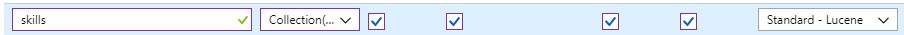

### **This tutorial assumes you already have an instance of Azure Search running. See the documentation here to get started with Azure Search https://docs.microsoft.com/en-us/azure/search/**

If you're unfamiliar with Azure Search Cognitive Skills you can read more about them here:
https://docs.microsoft.com/en-us/azure/search/cognitive-search-concept-intro

## Prerequisites

Before running this sample, you must have the following:

* Install [Azure Core Tools version 2.x](functions-run-local.md#v2).

* Install the [Azure CLI]( /cli/azure/install-azure-cli). This article requires the Azure CLI version 2.0 or later. Run `az --version` to find the version you have.  
You can also use the [Azure Cloud Shell](https://shell.azure.com/bash).


## Deploy Docker Container to Azure Functions using Azure CLI

The first step is deploy your own instance of the Skills Extractor Azure Function.
You can build and host the container yourself from this repo or use the prebuilt container on Docker Hub: `mcr.microsoft.com/wwllab/skills/skills-extractor-cognitive-search`

> For a more complete walktrhough of deploying Azure Functions, Follow instructions here: 
https://docs.microsoft.com/en-us/azure/azure-functions/functions-create-function-linux-custom-image#create-a-resource-group


## Create a resource group

```azurecli-interactive
az group create --name myResourceGroup --location westus
```

## Create an Azure Storage account

```azurecli-interactive
az storage account create --name <storage_name> --location westus --resource-group myResourceGroup --sku Standard_LRS
```

## Create an App Service Plan for Linux

```azurecli-interactive
az appservice plan create --name myAppServicePlan --resource-group myResourceGroup --sku B1 --is-linux
```

## Create and deploy the custom image

The function app hosts the execution of your functions. Create a function app from a Docker Hub image by using the az functionapp create command.

```azurecli-interactive
az functionapp create --name <app_name> --storage-account  <storage_name>  --resource-group myResourceGroup \
--plan myAppServicePlan --deployment-container-image-name mcr.microsoft.com/wwllab/skills/skills-extractor-cognitive-search
```

## Configure the function app

The function needs the connection string to connect to the default storage account. The following command will add the necessary `AzureWebJobsStorage` setting to your function application settings

```azurecli-interactive
storageConnectionString=$(az storage account show-connection-string --resource-group myResourceGroup --name <storage_name> --query connectionString --output tsv)

az functionapp config appsettings set --name <app_name> \
--resource-group myResourceGroup \
--settings AzureWebJobsDashboard=$storageConnectionString \
AzureWebJobsStorage=$storageConnectionString
```

# Create a new Cognitive Skill in Azure Search

> For the full documentation on integrating custom cognitive skills see:
https://docs.microsoft.com/en-us/azure/search/cognitive-search-custom-skill-interface

## Add a `skills` field to your search index

Open your search index in the Azure Portal and add a new field with a skills field.
You can also update your search index using the Azure Search REST API docs here:
https://docs.microsoft.com/en-us/azure/search/search-what-is-an-index




## Get the Function Url from the Azure Portal

Open the [Azure Portal](https://portal.azure.com) and navigate to the function app you created to in the previous step.

Click Get Function URL


And copy the Function URL


## Create a new skillset in Azure Search that points to your function url

Change content `"source": "document/content"` to the attribute that has the most text in for each document in your search index. 

For Example: `"source": "document/description"` if you have a `description` attribute for each document in your search index.

```http
PUT https://[servicename].search.windows.net/skillsets/extractSkills?api-version=2017-11-11-Preview
api-key: [admin key]
Content-Type: application/json
```
```json
{
    "skills": [
      ...,  
      {
        "@odata.type": "#Microsoft.Skills.Custom.WebApiSkill",
        "description": "Extract skills from each document",
        "uri": "[Your function url here]",
        "batchSize": 100,
        "context": "/document",
        "inputs": [
          {
            "name": "text",
            "source": "/document/content"
          }
        ],
        "outputs": [
          {
            "name": "skills",
            "targetName": "skills"
          }
        ]
      }
  ]
}
```

## Create a new indexer to map the `skills` output field to a search index

```http
PUT https://[servicename].search.windows.net/indexers/[indexer name]?api-version=2017-11-11-Preview
api-key: [admin key]
Content-Type: application/json
```
```json
{
    "name": "myIndexer",
    "dataSourceName": "myDataSource",
    "targetIndexName": "myIndex",
    "skillsetName": "extractSkills",
    "outputFieldMappings": [
        {
            "sourceFieldName": "/document/skills",
            "targetFieldName": "skills"
        }
    ]
}
```

## Check your search index and you should see a new skills array 


```http
PUT https://[servicename].search.windows.net/indexes/[indexer name]/docs?api-version=2017-11-11-Preview&search=machine learning
api-key: [admin key]
Content-Type: application/json
```

## Real World Example Response for skills extracted from a job description from the Microsoft Careers Page
```json
{
    "@odata.context": "https://microsoft-careers.search.windows.net/indexes('[indexer name]')/$metadata#docs(*)",
    "value": [
        {
            "@search.score": 1.5600916,
            "job_id": 588309,
            "title": "Applied Machine Learning Developer",
            "description": "The Xbox Advanced Technology Group (ATG) provides deep technical consultation and integration services to game developers world-wide as they create cutting-edge experiences for Microsoft game platforms and services. Our team also does advanced research and incubation and we are seeking an Applied Machine Learning Developer to help us bring Machine Learning techniques to gaming. If you have a strong ML/graphics background and can roll up your sleeves to do the engineering work required to ship high quality ML models in production, this is a unique opportunity to tackle challenging problems in the gaming and graphics space! Responsibilities Develop high-performance machine learning systems for gaming ML scenarios and graphics techniques.Develop optimized GPU kernels for deep learning inference via DirectX and DirectML and other graphics technologies.Do analysis on performance on internal and 3PP machine learning models and propose improvements and optimizations.Develop infrastructure as required to enable high performance ML in gaming.Act as an expert in applied machine learning to serve the needs of Game Developers Qualifications Required Qualifications: Masters or PhD or equivalent experience in relevant discipline (Machine Learning, Computer Science, Engineering)3+ years of relevant work experienceExperience in GPU programming (DirectX, Vulkan, OpenCL, etc) and performance modelling, profiling and optimization. Preferred Qualifications:Game Development experience - one or more shipped titles.Experience with Azure cloud services.Experience with Mobile/Tablet machine learning developmentMicrosoft is an equal opportunity employer. All qualified applicants will receive consideration for employment without regard to age, ancestry, color, family or medical care leave, gender identity or expression, genetic information, marital status, medical condition, national origin, physical or mental disability, political affiliation, protected veteran status, race, religion, sex (including pregnancy), sexual orientation, or any other characteristic protected by applicable laws, regulations and ordinances. We also consider qualified applicants regardless of criminal histories, consistent with legal requirements. If you need assistance and/or a reasonable accommodation due to a disability during the application or the recruiting process, please send a request via the Accommodation request form. Benefits/perks listed below may vary depending on the nature of your employment with Microsoft and the country where you work. XGAXGCATG#gamingjobs",
            "category": "Engineering",
            "subCategory": "Software Engineering",
            "country": "United States",
            "state": "Washington",
            "id": "513c8222-8004-d30b-8993-4c759fb05c9b",
            "skills": [
                "machine-learning",
                "engineering",
                "deep-learning",
                "inference",
                "computer-science",
                "game-development",
                "azure",
                "mobile"
            ]
        }
        ...
    ]
}
```

## Troubleshooting

*   ### If you get timeout errors while running the indexer in Azure Search, change `batchSize` in the skillset definition to a lower number (e.g. 50)

For Example:
```http
PUT https://[servicename].search.windows.net/skillsets/extractSkills?api-version=2017-11-11-Preview
api-key: [admin key]
Content-Type: application/json
```
```json
{
    "skills": [
      ...,  
      {
        "@odata.type": "#Microsoft.Skills.Custom.WebApiSkill",
        "description": "Extract skills from each document",
        "uri": "[Your function url here]",
        "batchSize": 50,
        "context": "/document",
        "inputs": [
          {
            "name": "text",
            "source": "/document/content"
          }
        ],
        "outputs": [
          {
            "name": "skills",
            "targetName": "skills"
          }
        ]
      }
  ]
}
```